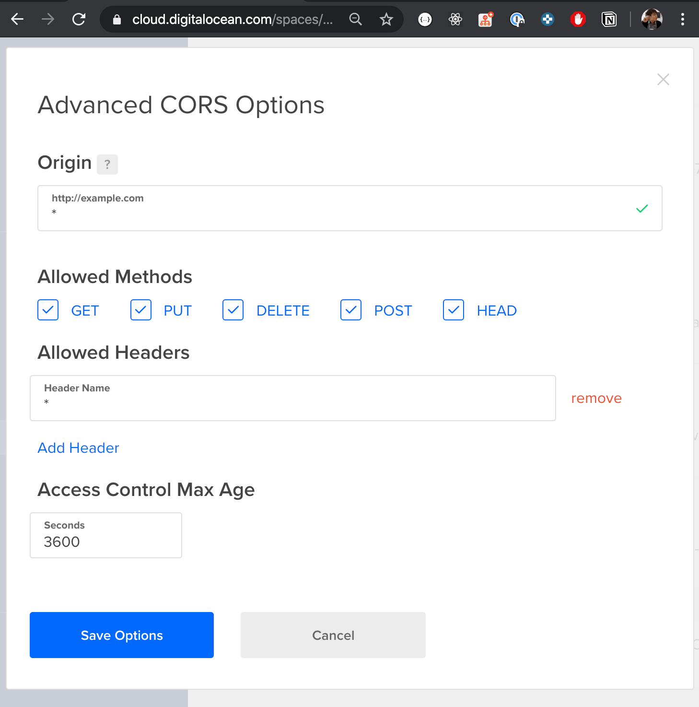

# S3 Web Uploader


A minimalistic UI to conveniently upload and download files from
[AWS S3](https://aws.amazon.com/s3/?nc=sn&loc=1) /
[Digital Ocean Space](https://m.do.co/c/62579dc21130) / [MinIO](https://docs.min.io/)

Live Demo: https://gaplo917.github.io/S3WebUploader

# Highlights

- Angular based web client for uploading/downloading file(s) from AWS S3
- Track multiple upload progress through one consistent UI.
- Tree-like folder browser so you can find the files you want faster
- Drag-and-drop upload with support for single file, multiple files and folder upload
- Support multiple account Login
- Securely encrypt credential with standalone master password and save in browser
- Options to rename files during upload
- Support Virtual-host style endpoint

# Built On

This app is built with many amazing framework, including:

<a href="https://angular.io/"></a>
<a href="https://ionicons.com/"></a>
<a href="https://github.com/creativetimofficial/argon-design-system"></a>

# Project History

This project is modified from fully-coupled electron-based project
https://github.com/Yamazaki93/S3Uploader/tree/762121ab33fe4854b1ec3f94d5bcc260f05f7e6d.

### Frictions of Electron

[Yamazaki93/S3Uploader](https://github.com/Yamazaki93) use `aws-sdk/NodeJs` inside the electron to
communicate with S3. This solved a lot of **limitation of browsers**, for example

- solved CORS(Cross Origin Resource Sharing) issues
- download a file inside electron using S3 `getObject` API(able to show progress), then write to
  file system.
- choosing a custom download path
- reading file system to retrieve `~/.aws` credentials

However, for whom want to upload things to S3 compatible service momentarily, installing an electron
application has too much frictions.

Let alone, I think electron application granted too much permissions for this simple purpose (If it
can read your `~/.aws` credentials, what else can it read?).

So, I decided to rewrite the S3 communication part completely to build a fully browser-compatible
version<sup>\*</sup>.

<sup>\* Some user experience has been changed due to browser limitation</sup>

### Browser-compatible Implementation

- Rewrite the communication part with `aws-sdk-js` completely, now it is a browser-compatible tree
  view & drag-drop upload
- Reuse most of the UI from Yamazaki93/S3Uploader with some enhancements and bug fixes
- Added MinIO Demo for S3-compatible service
- Support Virtual-host style endpoint
- Store all user inputs securely in browser with a custom single master password by applying
  - `pbkdf2` hash `master password` and store in LocalStorage for password verification
  - `HmacSHA512` hash `master password` to produce fixed length `secret` for AES256 encryption
  - You have to unlock with master password every time

### CORS Limitation

[MinIO](https://docs.min.io/) 's API enabled by default on all buckets for all HTTP verbs. However,
DigitalOceanSpace & S3 are not.

There are two ways to solve CORS:

1. Host S3WebUploader (Static Web App) on your own bucket
1. Configure CORS settings on your bucket



## Getting Start

```
# development
yarn install
yarn start

# Test
yarn test

# Liniting
yarn lint

# production build
yarn build

```

# More cool projects?

I sincerely believe I couldn't complete this project within a day (< 12 hours) without the following
tools that improve my productivity of reading/writing code.

- [GapStyle - A productivity-oriented and experience-driven designed IntelliJ IDEA color scheme](https://github.com/gaplo917/GapStyle)
- [Ligatured-Hack - My Favourite Hack Font with Ligatures](https://github.com/gaplo917/Ligatured-Hack)

# Credit

Thanks for the amazing works of [Yamazaki93/S3Uploader](https://github.com/Yamazaki93) that built
with a clean and consistent Angular architecture initially.

# License

MIT
